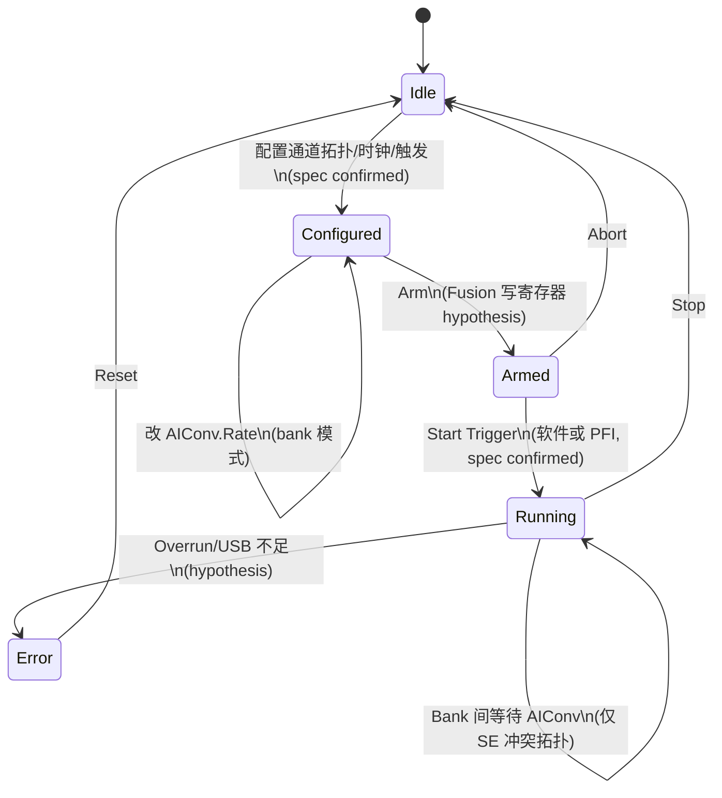

# AI 同步采集状态机（规格层）

> 与 `spec_sync_model.md` 配套。转移的“实现触发”多为 hypothesis；状态语义来自规格 = confirmed。

## Mermaid

## 状态说明

| 状态 | 规格含义 | 证据等级 |
|------|----------|----------|
| Idle | 未采样 | confirmed（语义） |
| Configured | 拓扑+sample clock(+AIConv) 已定 | confirmed |
| Armed | 等待 start trigger | confirmed 概念；FX3 如何 arm = hypothesis |
| Running | 共享 clock 上 convert + FIFO | confirmed（SPEC-SYNC-LAYER） |
| Error | FIFO/链路异常类 | hypothesis（无固件日志证据） |

## Bank 分支

- **无冲突**（≤16 路且每 ADC 一路）：Running 内每拍全通道同时。
- **SE 成对冲突**：Running 内交替 bank0(AI0:7) / bank1(AI8:15)，间隔 `AIConv.Rate`（`SPEC-BANK`）。

## FX3 假设点（不得升 confirmed）

- Configured→Armed、Armed→Running 的 Fusion vendor 请求
- Error 检测与上报

升级手段见 `OMISSIONS_AND_REMAINING.md`（抓包 / 寄存器表）。
