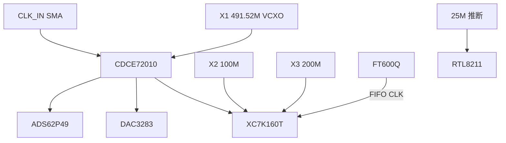

# 时钟树（综合稿）

> 来源：[时钟树分析](bc-5e99f486-ddb5-548b-b9bc-d65af7d2565f)

## 时钟源

| 位号 | 频率 | 类型 | 用途 | 等级 |
|------|------|------|------|------|
| X1 | **491.52 MHz** | VCXO | CDCE72010 环路 | ✅/🔶 |
| X2 | **100 MHz** | 差分有源 | FPGA 系统主钟 | ✅/🔶 |
| X3 | **200 MHz** | 有源 | MIG / IDELAYCTRL | ✅/🔶 |
| （推断） | **25 MHz** | 晶体 | RTL8211 PHY | 🔶 |
| CLK_IN SMA | 外部参考 | 输入 | CDCE72010 PRI/SEC_REF | ✅ |
| FT600 内部 | 66/100 MHz | 片内 | FIFO CLK→FPGA | ✅ |

## 分配要点

- **采样域同源**：CDCE72010 从 491.52 MHz 分频 → ADS62P49 / DAC3283 / FPGA 采样逻辑  
- **数字域异步**：100M / 200M / USB FIFO / RGMII 125M，靠 FPGA FIFO 跨域  
- **TRIG** 为触发非时钟

## 应用域推断

**491.52 MHz = 3GPP 频率族**（30.72×16 等）→ 强指向 **SDR / 无线中射频**（🔶），与 ADS62P49+DAC3283+CDCE72010 组合一致。

## Mermaid

## 待测

CDCE 各路实际分频比；CLK_IN 期望频率；X2 是否兼作辅助参考。
