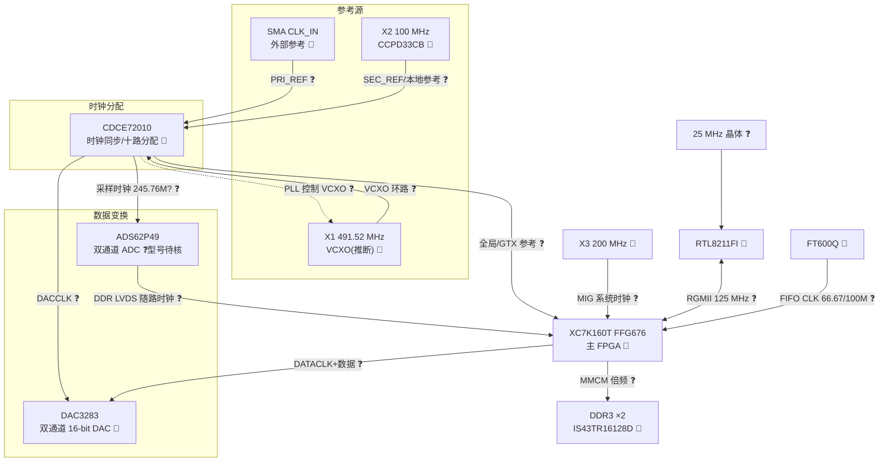

# 时钟树（初稿）

> 来源:zero0000 PCB 照片人工识读 + 已识别芯片的公开 datasheet 拓扑推断。
> 尚无任何示波器/频率计实测数据,所有连接关系均为推断,以照片位置邻近性与芯片典型应用电路为依据。

## 证据等级说明

| 等级 | 含义 |
|------|------|
| ✅ | 实测确认或文档确证 |
| 🔶 | 照片丝印可见 / 多源一致 |
| ❓ | datasheet 典型拓扑推断,待实测 |

## 板上时钟源清单

| 位号 | 器件 | 频率 | 位置 | 证据等级 | 证据 |
|------|------|------|------|----------|------|
| X1 | HCI 振荡器(疑 VCXO) | 491.52 MHz | CDCE72010 正上方 | 🔶 | 丝印 `HCI AE 491.520` |
| X2 | CTS CCPD-033(LVDS OSC) | 100 MHz | CDCE72010 下方 | 🔶 | 丝印 `CCPD33CB 100M ●10MT` |
| X3 | 振荡器 | 200.00 MHz | FPGA 左下角、DDR3 侧 | 🔶 | 丝印 `200.00 B2M4Z` |
| J8 (SMA) | 外部参考时钟输入 CLK_IN | 外部输入 | 板边(红帽) | 🔶 | 丝印 `CLK_IN` |
| — | RTL8211FI 附属晶体 | 25 MHz(推断) | PHY 附近 | ❓ | RTL8211 系列需 25 MHz 晶体,照片未辨认清楚 |
| — | FT600Q 时钟 | 内部 PLL / FIFO CLK 66.67 或 100 MHz 输出 | — | ❓ | FT60x 典型设计,FIFO 时钟由 FT600 输出给 FPGA |

## 拓扑推断

CDCE72010 是 TI 的十路输出时钟同步/抖动清除器,其 PLL 需要**外部 VCXO** 闭环——这正好解释了 X1(491.52 MHz)紧贴其放置:

- **参考输入**:CLK_IN(SMA)为主参考 PRI_REF;X2 的 100 MHz 很可能作为 SEC_REF 或无外参考时的本地参考,保证无外部时钟时系统也能工作。
- **VCXO 环路**:X1 491.52 MHz 接 VCXO_IN,PLL 将其锁定到参考上。491.52 MHz = 16 × 30.72 MHz,是软件无线电/采样系统常用频率;÷2 = 245.76 MHz,恰好落在 ADS62P49 的最大 250 MSPS 之内。
- **输出分配**(均为推断):
  - ADS62P49 采样时钟(如 245.76 MHz = 491.52/2);
  - DAC3283 的 DACCLK(≤800 MSPS,可用 491.52 MHz 或其倍/分频);
  - FPGA 的全局时钟/GTX 参考时钟若干路。
- ADS62P49 随路输出 DDR LVDS 数据时钟给 FPGA;DAC3283 由 FPGA 送 DATACLK 随路数据。
- X3 的 200 MHz 位于 FPGA 与 DDR3 之间,与 Kintex-7 MIG(DDR3 控制器)的典型 200 MHz 系统时钟/IDELAYCTRL 参考一致;DDR3 为 IS43TR16128D-125(DDR3-1600 等级),MIG 内部 MMCM 再倍频出 DDR 时钟。
- RTL8211FI 以 25 MHz 晶体为基准,通过 RGMII 与 FPGA 互传 125 MHz 收发时钟。
- FT600Q 向 FPGA 输出 FIFO 接口时钟(245 模式 66.67 MHz 或 100 MHz)。

## Mermaid 时钟树

## 关键疑点与待证实验

1. **X1 是否为 VCXO**:若只是普通 OSC,则 CDCE72010 可能仅作分配器(SPI 旁路 PLL)。→ 找 X1 完整料号 / 测其控制引脚是否连 CDCE 的 PLL 滤波环路。
2. **CLK_IN 与 100 MHz 谁是主参考**:示波器测 CDCE 的 PRI_REF/SEC_REF 引脚。
3. **ADC 实际采样率**:上电后测 ADS62P49 CLK 引脚频率(预期 245.76 MHz 或 122.88 MHz)。
4. **DAC3283 时钟方案**:测 DACCLK 频率,确认插值倍数(×2/×4)。
5. **CDCE72010 寄存器配置**:从 FPGA 固件(mcs)中提取 SPI 初始化序列,可直接反推整棵时钟树 → 与 `02_firmware` 任务联动。
6. **200 MHz 归属**:确认 X3 输出进入哪个 FPGA bank(MRCC/SRCC 引脚),验证 MIG 假设。
