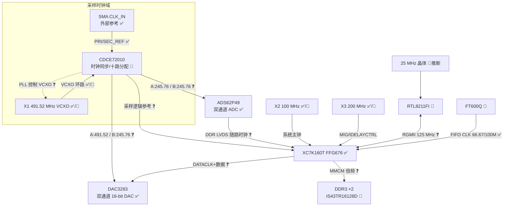

# 时钟树（综合稿 v2）

> 来源：[时钟树分析](bc-5e99f486-ddb5-548b-b9bc-d65af7d2565f) + zero0000 PCB 照片人工识读 + 已识别芯片 datasheet 拓扑推断。
> 频率数值来自丝印与固件侧印证；具体分频比尚无示波器/频率计实测。

## 证据等级说明

| 等级 | 含义 |
|------|------|
| ✅ | 实测确认或文档/固件确证 |
| 🔶 | 照片丝印可见 / 多源一致 |
| ❓ | datasheet 典型拓扑推断，待实测 |

## 板上时钟源清单

| 位号 | 器件/类型 | 频率 | 位置 | 用途 | 等级 | 证据 |
|------|-----------|------|------|------|------|------|
| X1 | HCI VCXO | **491.52 MHz** | CDCE72010 正上方 | CDCE72010 VCXO 环路 | ✅/🔶 | 丝印 `HCI AE 491.520`；紧贴 CDCE 布局 |
| X2 | CTS CCPD-033 差分有源 OSC | **100 MHz** | CDCE72010 下方 | FPGA 系统主钟 | ✅/🔶 | 丝印 `CCPD33CB 100M ●10MT` |
| X3 | 有源 OSC | **200.00 MHz** | FPGA 左下、DDR3 侧 | MIG / IDELAYCTRL 参考 | ✅/🔶 | 丝印 `200.00 B2M4Z` |
| J8 (SMA) | CLK_IN 外部参考输入 | 外部输入 | 板边（红帽） | CDCE72010 PRI/SEC_REF | ✅ | 丝印 `CLK_IN` |
| —（推断） | 晶体 | 25 MHz | RTL8211FI 附近 | PHY 基准 | 🔶 | RTL8211 系列必需，照片未辨清位号 |
| FT600 内部 | 片内时钟 | 66.67/100 MHz | — | FIFO CLK 输出 → FPGA | ✅ | FT60x datasheet |

## 分配要点

- **采样域同源**：CDCE72010 以 X1 491.52 MHz VCXO 闭环（外参考经 CLK_IN 进入 PRI/SEC_REF），分频输出到 ADS62P49、DAC3283 与 FPGA 采样逻辑。
- **双先验（未测）**：
  - **计划 A**：ADC≈245.76（÷2），DACCLK≈491.52（÷1）→ DAC 2x 时数据率 245.76
  - **计划 B（Conserviss 硬件）**：使能 CDCE 输出均为 ÷2 → **ADC 与 DACCLK 均为 245.76**，DAC 2x → 数据率 122.88（`decode_cdce_profile.py`；Reg2=Output2÷2=ADC）
- **数字域异步**：X2 100 MHz（FPGA 系统）、X3 200 MHz（MIG/IDELAYCTRL）、FT600 FIFO CLK、RGMII 125 MHz 各自独立，靠 FPGA 内 FIFO 跨时钟域。
- **随路时钟**：ADS62P49 向 FPGA 输出 DDR LVDS 随路数据时钟；FPGA 向 DAC3283 送 DATACLK 随路数据。
- **DDR3**：IS43TR16128D-125（DDR3-1600 等级），MIG 内部 MMCM 由 200 MHz 倍频出 DDR 时钟。
- **TRIG** SMA 为触发信号，非时钟。

## 应用域推断

**491.52 MHz = 3GPP 频率族**（30.72 MHz × 16 等）→ 强指向 **SDR / 无线中射频**（🔶），与 ADS62P49 + DAC3283 + CDCE72010 组合一致。

## Mermaid 时钟树

## 待证实验

1. **CDCE72010 各路实际分频比**：从 FPGA 固件（mcs）提取 SPI 初始化序列反推，或上电测各输出频率 → 与 `02_firmware` 任务联动。
2. **CLK_IN 期望频率**：结合 CDCE 寄存器配置确定（常见 10/30.72/61.44/122.88 MHz）。
3. **X2 是否兼作 CDCE 辅助参考**：测 CDCE 的 SEC_REF 引脚走线。
4. **X1 VCXO 属性确认**：找完整料号 / 测其控制引脚是否接 CDCE 环路滤波。
5. **ADC 实际采样率**：上电测 ADS62P49 CLK 引脚（预期 245.76 或 122.88 MHz）。
6. **DAC3283 插值倍数**：测 DACCLK 与 DATACLK 频率比（×1/×2/×4）。
