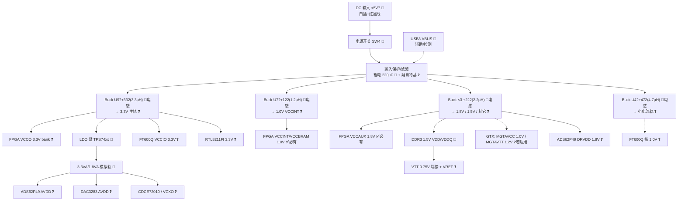

# 电源树（综合稿 v2）

> 来源：[电源树分析](bc-ec0a167c-845b-5ce3-b0a1-388ee085fc9c) + zero0000 PCB 照片人工识读 + 已识别芯片供电需求（datasheet）反推。
> **所有电压轨均未实测**；DC-DC 控制器丝印过小，照片无法识读型号。

## 证据等级说明

| 等级 | 含义 |
|------|------|
| ✅ | 实测确认或文档确证 |
| 🔶 | 照片丝印可见 / 多源一致 |
| ❓ | datasheet 需求反推，待实测 |

## 输入级

| 入口 | 判断 | 等级 | 证据 |
|------|------|------|------|
| 外接 DC（白色 4-pin 插座/红黑线 + 拨动开关 SW4） | **主供电**，疑似 **≈5 V**（入口钽电 227C = 220 µF，该封装常见 16 V 耐压） | 🔶 | 照片可见插座、开关、黄色钽电 `A 227 C` |
| USB3 VBUS | 辅助/检测用，不宜作满载主电 | 🔶 | FT600 侧 USB 口 |
| 黑色两端子大件（电源入口） | 疑保险丝座/滤波件 | ❓ | 照片可见但型号不明 |
| 黑色两引脚功率器件 ×2（白框内，FPGA 右侧） | 疑肖特基二极管（防反接/整流/ORing） | ❓ | 封装外观判断 |

## DC-DC 变换级（按功率电感识别）

照片中可辨认的功率电感是各 buck 的"指纹"（丝印为感值代码）：

| 电感丝印 | 感值 | 邻近 IC 位号 | 推断输出轨 | 等级 | 依据 |
|----------|------|--------------|------------|------|------|
| 122 | 1.2 µH | U7 | **1.0 V 大电流**（FPGA VCCINT） | ❓ | 小感值 = 大电流低压典型配置 |
| 332 | 3.3 µH | U9 | **3.3 V 主轨** | ❓ | 全板用量最大轨 |
| 222 ×3 | 2.2 µH | U12/U16 等（FPGA 右侧成排） | **1.8 / 1.5 / 其它**（MGT 轨?） | ❓ | 三路独立 buck 紧邻 FPGA/DDR3 |
| 472 | 4.7 µH | U4（板右上） | 小电流轨 | ❓ | 较大感值 = 小电流 |

模拟净轨：疑 **TPS74xx 系列 LDO**（🔶，近拍待确认）产生 3.3VA/1.8VA 供 ADC/DAC/时钟；铁氧体磁珠（FB1、FB2、FB6、FB12–FB14 等丝印可见 🔶）做数字/模拟隔离。

## 电压轨假设（负载需求反推）

| 轨 | 用途 | 等级 |
|----|------|------|
| 1.0 V | FPGA VCCINT/VCCBRAM | ✅ 必有 / 🔶 来源 |
| 1.8 V | FPGA VCCAUX；ADS62P49 DRVDD；DAC3283 AVDD/DVDD | ✅/🔶 |
| 3.3 V | IO / FT600 VCCIO / RTL8211 / Flash / 振荡器 / CDCE72010 | ✅/🔶 |
| 1.5 V + VTT 0.75 V | DDR3 VDD/VDDQ + 端接/VREF | 🔶 |
| 3.3VA / 1.8VA | ADC/DAC/时钟模拟轨（LDO） | 🔶 |
| 1.0 V / 1.2 V（若 GTX 启用） | MGTAVCC / MGTAVTT | ❓ |
| 1.0 V | FT600Q 核（VD） | ❓ |

## Mermaid 电源树

## 上电安全（必读）

1. 确认极性与电压（入口钽电容常见 16 V 耐压，勿超压）。
2. 限流电源起步（建议 5 V / 0.5 A），逐步放开。
3. 上电前测各轨对地阻抗，排除短路。
4. 先外电后 USB，防止 VBUS 与主电互灌。
5. 未上电勿向 SMA 灌大信号。

## 待证实验（优先级排序）

1. **输入电压规格**：万用表沿插座→开关→第一级 buck 输入追踪，看 buck 芯片耐压；或找配套适配器标注。→ 安全上电前提。
2. **各电感输出电压**：上电后依次测每颗功率电感输出端对地电压，可一次性把大部分 ❓ 升级为 ✅。
3. **DC-DC/LDO 型号**：显微近拍 U4/U7/U9/U12/U16 及疑似 TPS74xx 丝印，对照顶标库。
4. **蜂鸣档追线**：电感输出 → FPGA/DDR/ADC 去耦电容，确认电感-轨对应表。
5. **VTT 端接稳压器定位**：DDR3 附近找 SOT-23-5/DFN 小件，确认 0.75 V。
6. **上电时序**：示波器多通道抓各轨上升沿，判断是否有 PMIC/时序控制。
7. 与 `BOM_证据分级.md` 电感行统一位号后互相更新。
