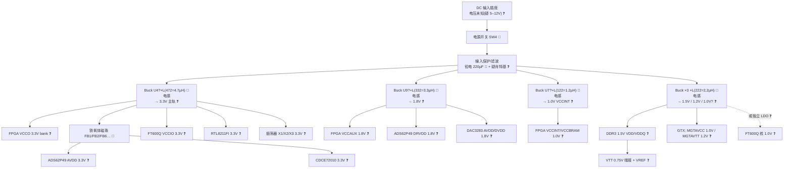

# 电源树(初稿)

> 来源:zero0000 PCB 照片人工识读 + 已识别芯片的供电需求(datasheet)反推。
> **所有电压轨均未实测**,轨电压是由负载芯片需求倒推的假设;DC-DC 控制器芯片丝印过小,照片无法识读型号。

## 证据等级说明

| 等级 | 含义 |
|------|------|
| ✅ | 实测确认或文档确证 |
| 🔶 | 照片丝印可见 / 多源一致 |
| ❓ | datasheet 需求反推,待实测 |

## 输入级(照片可见)

| 元件 | 位置 | 功能假设 | 证据等级 | 证据 |
|------|------|----------|----------|------|
| 白色 4-pin 插座 + 红黑线 | 板边(顶部) | 外部 DC 输入,电压规格未知(疑 5–12 V) | ❓ | 照片可见,无丝印标压 |
| 拨动开关 SW4 | 电源插座旁 | 主电源开关 | 🔶 | 位置与走线判断 |
| 黑色两端子大件(疑保险丝座/滤波件) | 电源入口 | 输入保护/滤波 | ❓ | 照片可见但型号不明 |
| 黄色钽电容 `A 227 C`(220 µF) | 输入端 | 输入大容量滤波 | 🔶 | 丝印可见 |
| 黑色两引脚功率器件 ×2(白框内,FPGA 右侧) | 输入/中间级 | 疑肖特基二极管(防反接/整流) | ❓ | 封装外观判断 |

## DC-DC 变换级(按功率电感识别)

照片中可辨认的功率电感即各 buck 的"指纹"(丝印为感值代码):

| 电感丝印 | 感值 | 邻近 IC 位号 | 推断输出轨 | 证据等级 | 依据 |
|----------|------|--------------|------------|----------|------|
| C472 | 4.7 µH | U4(板右上) | 3.3 V 主轨 | ❓ | 较大感值+靠近输入端,3.3 V 为全板用量最大轨 |
| C332 | 3.3 µH | U9 | 1.8 V(VCCAUX/ADC/DAC 数字) | ❓ | 中等感值 |
| C122 | 1.2 µH | U7 | 1.0 V 大电流(FPGA VCCINT) | ❓ | 小感值=大电流低压典型配置 |
| C222 ×3 | 2.2 µH | U12/U16 等(FPGA 右侧成排) | 1.5 V(DDR3)、1.2 V(MGTAVTT?)、1.0 V(MGTAVCC?) 等 | ❓ | 三路独立 buck 成排,紧邻 FPGA/DDR3 |

另有多处 SOT/SOIC 小封装(如 U24、U31、U33 附近)疑为 LDO 或电源监控,用于模拟轨;铁氧体磁珠(FB1、FB2、FB6、FB12–FB14 等丝印可见 🔶)将数字轨滤波后分出模拟净轨。

## 负载需求反推(datasheet 依据)

| 负载芯片 | 需要的电压轨 | 证据等级 |
|----------|--------------|----------|
| XC7K160T | VCCINT/VCCBRAM 1.0 V;VCCAUX 1.8 V;VCCO 3.3/2.5/1.8/1.5 V(按 bank);若用 GTX:MGTAVCC 1.0 V、MGTAVTT 1.2 V | ❓(7 系列 datasheet 确定,分配待测) |
| DDR3 IS43TR16128D ×2 | VDD/VDDQ 1.5 V;VTT 0.75 V(需 VTT 端接稳压器);VREF 0.75 V | ❓ |
| ADS62P49(待核) | AVDD 3.3 V;DRVDD 1.8 V | ❓ |
| DAC3283 | AVDD/DVDD 1.8 V(模拟侧经磁珠隔离) | ❓ |
| CDCE72010 | VCC 3.3 V(建议净模拟 3.3 V) | ❓ |
| FT600Q | VCCIO 3.3 V + VD 1.0 V 核 | ❓ |
| RTL8211FI | 3.3 V IO + ~1.1 V 核(部分型号内置 LDO) | ❓ |
| 振荡器 X1/X2/X3 | 3.3 V(X2 丝印 CCPD33 = 3.3 V 系列) | 🔶/❓ |

## Mermaid 电源树

## 待证实验(优先级排序)

1. **输入电压规格**:万用表沿输入插座→开关→第一级 buck 输入引脚测通断,再看 buck 芯片耐压;或找外壳/电源适配器标注。→ 这是安全上电的前提。
2. **各电感输出电压**:上电后依次测每颗功率电感输出端对地电压,填实上表"推断输出轨"一列,可一次性把大部分 ❓ 升级为 ✅。
3. **DC-DC 控制器型号**:显微/微距拍摄 U4/U7/U9/U12/U16 丝印,对照 TI/MPS 顶标库。
4. **VTT 端接稳压器定位**:DDR3 附近找 SOT-23-5/DFN 小件,确认 0.75 V。
5. **上电时序**:FPGA 与 ADC/DAC 通常有时序要求,用示波器多通道抓各轨上升沿,判断是否有 PMIC/时序控制。
6. 与 `BOM_证据分级.md` 电感行合并,统一位号后更新该表。
