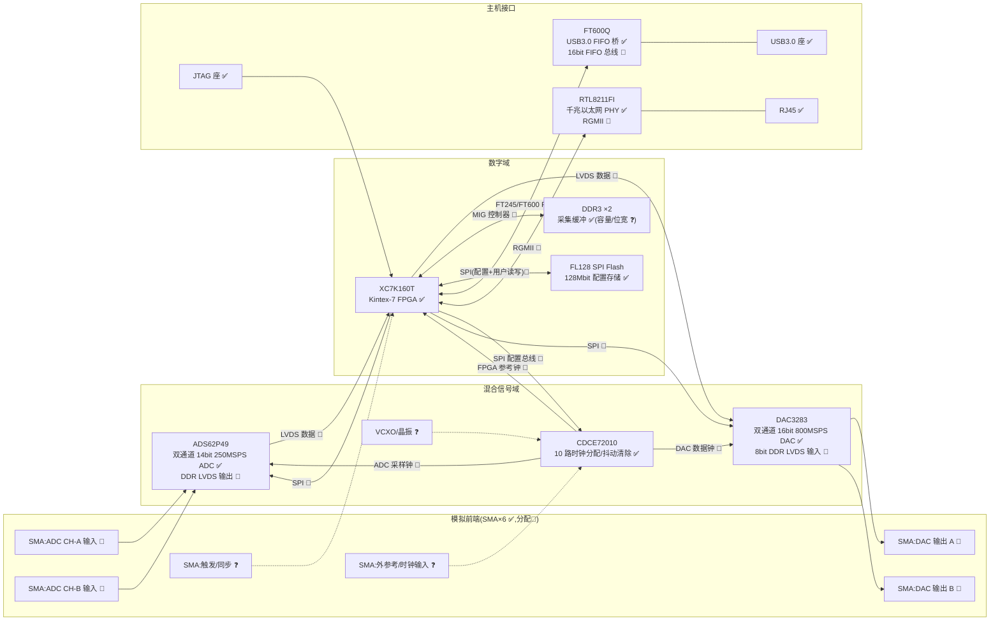
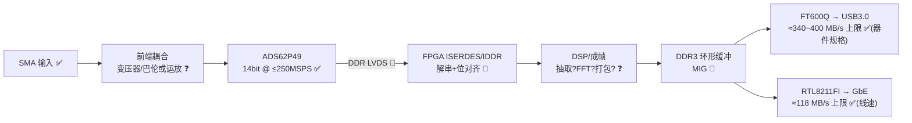
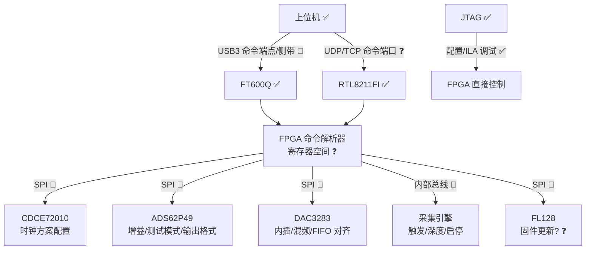

# L3 系统架构分析

> 研究对象:Kintex-7 高速信号板(zero0000)  
> 证据等级:✅ 确认(照片/丝印/数据手册可直接支撑) / 🔶 推断(基于器件典型用法与布局位置) / ❓ 待证(需固件分析或实物实验)  
> 前置输入:L1 已确认器件清单 —— XC7K160T、DDR3×2、FT600Q、RTL8211FI、ADS62P49、DAC3283、CDCE72010、FL128 Flash、SMA×6、USB3 座、RJ45、JTAG ✅

---

## 1. 系统总体框图

**框图说明**

| 连接 | 依据 | 等级 |
|------|------|------|
| ADS62P49 → FPGA 走 DDR LVDS | 该 ADC 仅有并行 CMOS/DDR LVDS 两种输出,250MSPS 下 LVDS 是唯一现实选择;器件紧邻 FPGA 高速 bank | 🔶 |
| DAC3283 ← FPGA 走 8bit 字节宽 DDR LVDS | DAC3283 固定为 8 位 LVDS 双沿字节接口(手册) | 🔶 |
| CDCE72010 为全板时钟枢纽 | 该器件即为 10 路输出时钟分配/抖动清除器,与 ADC/DAC 同侧布局 | 🔶 |
| FT600Q 与 FPGA 为 16bit FIFO 总线 | FT600Q 封装即 16bit(FT601 才是 32bit) | ✅(位宽)/🔶(模式 245 或 600) |
| RTL8211FI ↔ FPGA 为 RGMII | RTL8211F 系列仅支持 RGMII | ✅ |
| FL128 为主 SPI 配置引导 | Kintex-7 支持 Master SPI,板上无 BPI 并行 Flash 迹象 | 🔶 |
| DDR3 挂 FPGA MIG 控制器 | 板上无其他可驱动 DDR3 的器件 | ✅(拓扑)/❓(位宽 16/32、频率) |
| 6 个 SMA 的具体分配 | 2 入 2 出 + 时钟 + 触发为该类板卡惯例 | ❓(需照片丝印/走线核对) |

---

## 2. 数据链路(采集方向)

**带宽预算(推断依据器件规格)**

| 环节 | 峰值速率 | 等级 | 说明 |
|------|----------|------|------|
| ADC 原始产出 | 2ch × 14bit × 250MSPS ≈ 875 MB/s(按 16bit 对齐 1000 MB/s) | ✅ 器件规格 | 实际采样率取决于时钟配置 ❓ |
| FPGA↔DDR3 | 若 32bit@800MT/s ≈ 3.2 GB/s | ❓ | 位宽/频率待 PCB 走线与固件核对 |
| USB3(FT600Q) | 理论 5Gbps,实测典型 340~400 MB/s | ✅ 规格 / ❓ 实测 | 无法承载双通道满速连续流 → 必须缓冲或抽取 🔶 |
| GbE | ≈118 MB/s | ✅ | 仅够单通道低速率或抽取后数据 🔶 |

**关键推论 🔶**:USB3 与 GbE 均低于 ADC 满速产出,故 DDR3 的角色大概率是**采集缓冲/段模式(segment capture)**,即"突发满速采入 DDR3,再慢速回放到主机";或固件内含抽取/触发逻辑只上传片段。此推论可通过命令协议中是否存在"深度/预触发点"参数验证 ❓。

**采集方向待证清单 ❓**
1. ADC 前端是交流耦合(变压器)还是直流耦合(运放)——决定可测信号类型。
2. LVDS 是 1 线制还是 2 线制 DDR 输出模式(ADS62P49 可配)。
3. 是否双通道同时使能,还是单通道交织。
4. DDR3 是乒乓缓冲还是环形缓冲,深度多少。
5. USB 与以太网是"二选一"还是可同时工作。

---

## 3. 控制链路(命令方向)

**控制路径分层**

| 路径 | 内容 | 等级 |
|------|------|------|
| JTAG → FPGA | 比特流下载、Flash 间接烧写、ILA 调试;不依赖固件,是最底层保底通道 | ✅ |
| FL128 → FPGA | 上电 Master SPI 自举加载 `20230825_s2056.mcs` 对应镜像 | 🔶(模式引脚待照片确认) |
| 主机 → FPGA 运行时命令 | USB 或以太网承载;FT600Q 有独立的低速侧带/或复用 FIFO 通道拆分命令帧 | ❓(需抓包判定协议) |
| FPGA → 外设 SPI | CDCE72010/ADS62P49/DAC3283 三片均为 SPI 从机,由 FPGA 统一配置 | 🔶(唯一合理主控) |
| CDCE72010 EEPROM 自举 | 该器件内置 EEPROM,可能上电即输出默认时钟、不依赖 FPGA | 🔶(是否使用待证 ❓) |

**控制链路待证清单 ❓**
1. 命令协议格式(寄存器地址+数据?自定义帧?)——从 mcs 提取字符串或抓 USB 包。
2. 以太网是否有固定 IP/MAC,是否响应 ARP/ICMP。
3. 固件是否支持经 USB/网口在线更新 Flash。
4. CDCE72010 是 EEPROM 自举还是每次由 FPGA 写入。

---

## 4. 应用域三种假设及判别实验

### 假设 H1:高速数据采集卡(DAQ)🔶
双通道 250MSPS 采集为主,DAC 仅作辅助激励或未充分使用;DDR3 做深存储段采集。

### 假设 H2:软件无线电收发平台(SDR)🔶
ADC 采集中频、DAC3283 的 2/4 倍内插 + fs/2、fs/4 粗混频器发射中频,收发共用 CDCE72010 同源时钟;USB3 双向流。

### 假设 H3:通信/信号链测试仪(误码、信道、中频回环)❓
板内含 PRBS 发生/检测、回环、误码统计逻辑;以太网承载控制面,SMA 触发用于多板同步。

### 判别实验矩阵

| # | 实验 | 无需实物? | H1 指向 | H2 指向 | H3 指向 |
|---|------|-----------|---------|---------|---------|
| E1 | mcs 逆向:提取字符串、IP 核特征(MIG/Tri-MAC/FIFO/FFT/DDS) | ✅ 是 | 只见采集流水线、无 DDS | 同时存在 DDS/NCO、内插滤波器 | 出现 PRBS/BER/loopback 字样 |
| E2 | 照片核对 SMA 丝印与走线(IN/OUT/CLK/TRIG) | ✅ 是 | 输入通道占多数 | 2 入 2 出对称 | 有明显 TRIG/REF 标注 |
| E3 | 上电枚举 USB:端点数量、方向、描述符字符串 | ❌ 需实物 | 单向 IN 流为主 | IN+OUT 双大流量端点 | 小包命令端点为主 |
| E4 | 网口行为:DHCP/固定 IP、开放端口扫描 | ❌ 需实物 | 数据流端口(大 UDP) | 控制端口为主 | 控制+状态查询端口 |
| E5 | DAC 输出直测:上电后 SMA 输出端是否有默认波形/载波 | ❌ 需实物 | 静默 | 有中频载波或可命令激活 | 有 PRBS 类宽谱 |
| E6 | CDCE72010 读回配置:ADC/DAC 时钟是否同源同频面 | ❌ 需实物 | DAC 钟低频或关闭 | 收发严格同源 | 灵活多方案 |
| E7 | 命令协议探测:是否存在"预触发深度/段数"类参数 | ❌ 需实物 | 有(段采集特征) | 无,代之以增益/频率字 | 有 BER 计数读回 |

**判别优先级 🔶**:先做零成本的 E1、E2(纯静态,依赖 L2 的 bit 提取结果),形成倾向性结论后再用 E3~E7 在实物上证伪。

---

## 5. L3 架构阶段验收标准

| # | 验收项 | 通过标准 | 当前状态 |
|---|--------|----------|----------|
| A1 | 系统总体框图 | 覆盖全部 12 类已确认器件/接口;每条连线均带证据等级标注;无"未解释"器件 | 本文档初版完成,SMA 分配待升级 ❓→🔶 |
| A2 | 数据链路文档 | 采集方向逐级速率预算成表;瓶颈结论(USB<ADC 产出)有规格书页码支撑;待证项 ≤5 条且每条附实验方案 | 初版完成 |
| A3 | 控制链路文档 | JTAG/Flash/运行时三层控制路径分清;SPI 从机清单完整;命令协议至少给出探测方法 | 初版完成 |
| A4 | 时钟树专项 | CDCE72010 十路输出的去向表:≥6 路达到 🔶 及以上;输入源(VCXO/外参考)确定到 🔶 | ✅ 静态完成（见 `01_hardware/时钟树.md`）；分频实测待实物 |
| A5 | 电源树专项 | 主要电源轨(FPGA 核/IO、ADC/DAC 模拟、DDR3)拓扑成图,各轨等级 ≥🔶 | ✅ 静态完成（见 `01_hardware/电源树.md` S1/S7/S9）；轨电压终验待实物 |
| A6 | 应用域判定 | 三假设的 E1/E2 静态实验执行完毕并记录结论;实物实验 E3~E7 步骤书写至可直接执行的粒度 | 实验矩阵已定义,待执行 |
| A7 | 证据等级纪律 | 文档内每个技术断言均带 ✅/🔶/❓;❓ 项全部同步登记到 `00_meta` 未知问题清单 | 本文档已执行;登记待同步 |
| A8 | 交叉一致性 | 与 L1 BOM、L2 固件分析结论无冲突;冲突项显式列出并给出裁决实验 | 待 L1/L2 产出后复核 |

**L3 整体出口条件 🔶**:A1~A3、A6、A7 达标即可进入 L4(通信通路实测);A4、A5 允许以"带 ❓ 的完整表格"形态延后到实物阶段闭环,但表格结构必须先行建立。

---

*本文档由静态分析产出,所有 🔶/❓ 项的升级路径已在正文给出。下一步:执行 E1(mcs 特征提取,归属 L2)与 E2(照片走线核对,归属 L1),用结果回填本档。*
